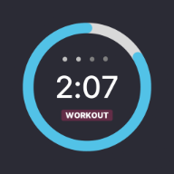
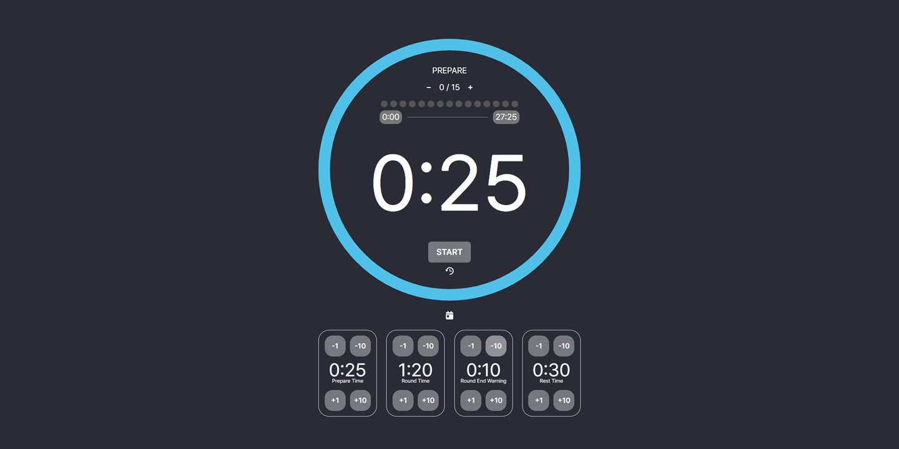
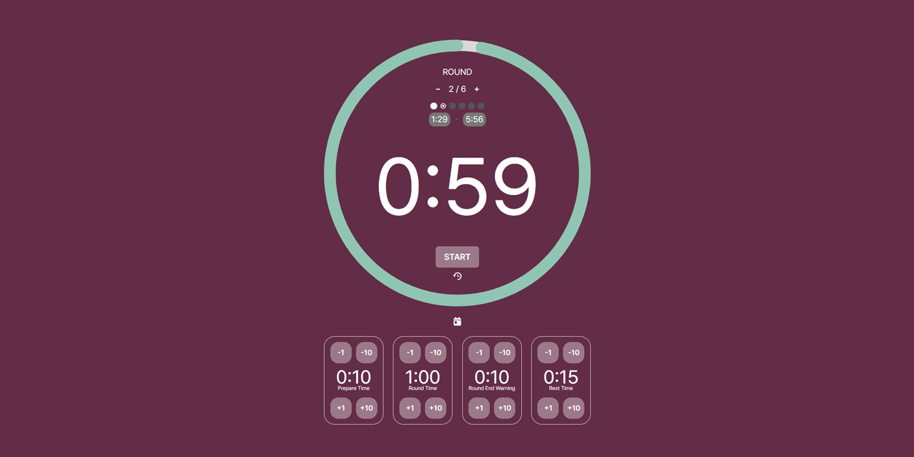
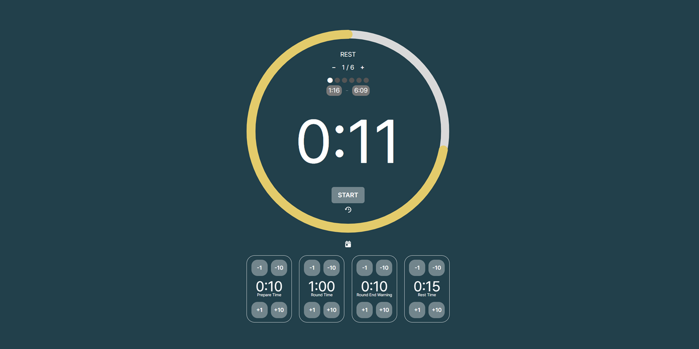
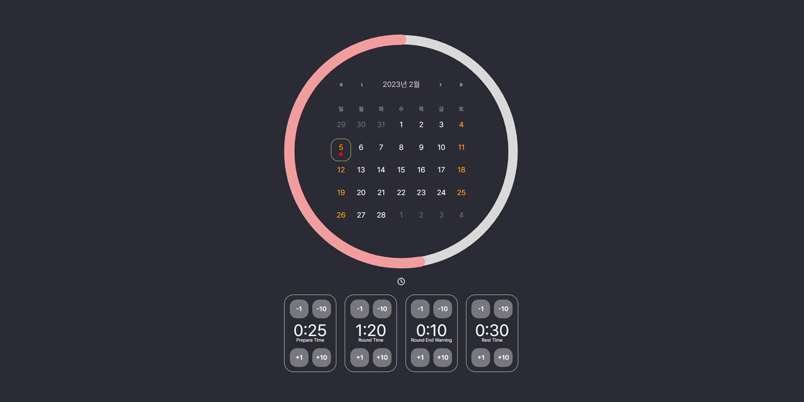
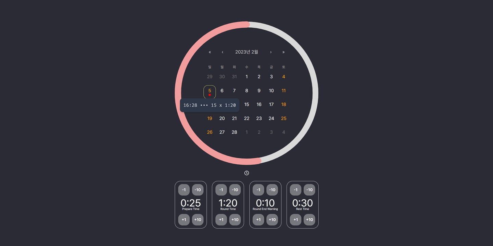

# Workout Timer







## Libraries

- React: https://beta.reactjs.org/
- Chakra UI: https://chakra-ui.com/

  ```sh
  yarn add @chakra-ui/react @emotion/react @emotion/styled framer-motion
  ```

  - https://www.coffeeclass.io/articles/use-disclosure-menu-chakra-ui
  - Media Query Breakpoint = {
    sm: 30em = 480px,
    md: 48em = 768px,
    lg: 62em = 992px,
    xl: 80em = 1280px,
    }

- React Router: https://reactrouter.com/en/main

  ```sh
  yarn add react-router-dom
  ```

- React Countdown Circle Timer: https://github.com/vydimitrov/react-countdown-circle-timer/tree/master/packages/web#readme
- moment: https://momentjs.com/
- React-Calendar: https://www.npmjs.com/package/react-calendar

## Reference

https://boxingtimer.org/
